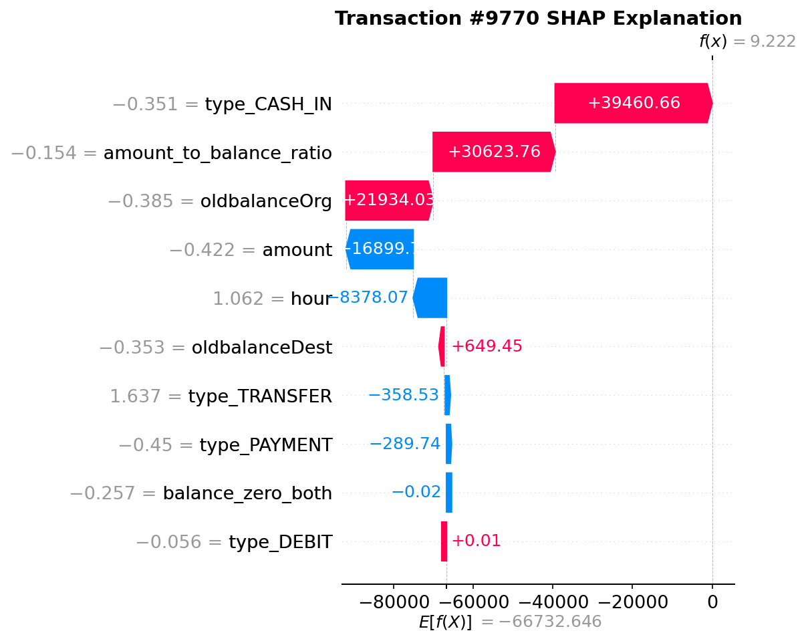

# XAI_FDS_Project

금융 사기 탐지(FDS) 모델 개발 및 XAI 기반 의심거래 보고서 자동화 시스템

---

## 📌 프로젝트 개요

본 프로젝트는 금융 거래 데이터를 기반으로 **이상거래 탐지(Fraud Detection)** 모델을 학습하고,  
SHAP 기반 XAI 분석 결과를 포함한 **의심거래 보고서(STR)** 를 자동 생성하는 것을 목표로 한다.

---

## 📊 데이터셋 설명

### **PaySim 데이터셋**

본 프로젝트는 **PaySim** 금융 거래 시뮬레이션 데이터셋을 사용합니다.

#### **데이터 개요**

- **출처**: Mobile Money Services (MMS) 거래 데이터 기반 시뮬레이션
- **목적**: 금융 사기 탐지 모델 개발 및 테스트
- **특징**: 실제 금융 거래 패턴을 모방한 합성 데이터

#### **데이터 구조**

```
- step: 시뀨적 단계 (1시간 단위)
- type: 거래 유형 (CASH_IN, CASH_OUT, DEBIT, PAYMENT, TRANSFER)
- amount: 거래 금액
- nameOrig: 송금인 계좌명
- oldbalanceOrg: 송금인 거래 전 잔액
- newbalanceOrig: 송금인 거래 후 잔액
- nameDest: 수취인 계좌명
- oldbalanceDest: 수취인 거래 전 잔액
- newbalanceDest: 수취인 거래 후 잔액
- isFraud: 사기 여부 (0: 정상, 1: 사기)
- isFlaggedFraud: 은행에서 사기로 플래그된 거래
```

#### **데이터 통계**

- **총 거래 수**: 약 6,362,620건
- **사기 거래**: 약 8,213건 (0.13%)
- **정상 거래**: 약 6,354,407건 (99.87%)
- **불균형 비율**: 1:773 (사기:정상)

#### **데이터 특징**

- **시계열성**: 시간 순서대로 정렬된 거래 데이터
- **불균형**: 사기 거래가 극도로 적음 (불균형 데이터 처리 필요)
- **다양성**: 5가지 거래 유형으로 다양한 패턴 포함
- **연관성**: 송금인/수취인 잔액 변화로 거래 패턴 분석 가능

#### **전처리 과정**

1. **피처 엔지니어링**: 잔액 대비 거래 금액 비율, 시간대별 패턴 등
2. **불균형 처리**: SMOTE 기법으로 소수 클래스 증강
3. **시계열 분할**: 시간 순서를 고려한 훈련/검증/테스트 분할
4. **스케일링**: StandardScaler를 통한 피처 정규화

---

## 📂 폴더 구조

```

XAI\_FDS\_Project/
├── data/
│   ├── 01\_raw/              # 원본 데이터 (변경 금지)
│   │   └── paysim.csv
│   └── 02\_processed/        # 전처리된 데이터
│       └── preprocessed\_data.csv
│
├── notebooks/               # 실험 및 분석용 노트북
│   ├── 01\_eda.ipynb
│   └── 02\_model\_prototyping.ipynb
│
├── outputs/                 # 모든 실행 결과물 통합 저장
│   ├── figures/             # 시각화 자료 (SHAP 플롯 등)
│   ├── metrics/             # 성능 지표 (JSON, PNG 등)
│   ├── models/              # 학습된 모델 (joblib 등)
│   └── reports/             # 최종 보고서 (STR\_Report.md 등)
│
├── scripts/                 # 실행 스크립트
│   ├── train.py             # 모델 학습 및 저장
│   ├── evaluate.py          # 모델 성능 평가
│   └── generate\_report.py   # STR 보고서 자동 생성
│
├── src/                     # 재사용 가능한 모듈
│   ├── preprocessing.py
│   ├── modeling.py
│   ├── evaluation.py
│   ├── xai.py
│   └── reporting.py
│
└── README.md

```

---

## ⚙️ 실행 방법

### 1. 모델 학습

```bash
cd XAI_FDS_Project
python scripts/train.py --imbalance smote --n_estimators 200 --seed 42
```

**옵션 설명**

- `--imbalance smote` : 불균형 데이터 보정 방법 (smote / none)
- `--n_estimators 200` : 모델 트리 개수 설정
- `--seed 42` : 랜덤 시드 고정

---

### 2. 모델 평가

```bash
python scripts/evaluate.py
```

- Confusion Matrix, Classification Report, AUPRC 등 주요 지표 저장

---

### 3. STR 보고서 생성

```bash
python scripts/generate_report.py --analysis_period "2025-08-01 ~ 2025-08-11"
```

- 분석 기간 동안의 의심거래 사례 + SHAP Top Features 포함 보고서 생성

---

## 📊 결과물 예시

| 결과물         | 설명                         | 예시 경로                                           |
| -------------- | ---------------------------- | --------------------------------------------------- |
| 모델 파일      | 학습된 모델 객체             | `outputs/models/model.joblib`                       |
| 성능 지표      | JSON, Confusion Matrix CSV   | `outputs/metrics/classification_report.json`        |
| XAI 시각화     | SHAP Bar Plot, Beeswarm Plot | `outputs/figures/shap_bar.png`                      |
| 개별 거래 분석 | 거래별 SHAP Waterfall Plot   | `outputs/figures/individual_shap_transaction_*.png` |
| 보고서         | STR 보고서 (Markdown/HTML)   | `outputs/reports/STR_Report.md/html`                |

---

### 📈 SHAP 분석 예시


### 🔍 개별 거래 SHAP 분석 예시



### 📄 STR 보고서 예시


---

## 🛠 환경 설정

### **1. 기본 환경 설정**

```bash
conda create -n xai_env python=3.10
conda activate xai_env
pip install -r requirements.txt
```

### **2. OpenAI API 키 설정**

LLM 기반 자동 해석 기능을 사용하려면 OpenAI API 키가 필요합니다.

```bash
# 방법 1: 스크립트 실행
./set_api_key.sh

# 방법 2: 직접 환경변수 설정
export OPENAI_API_KEY="your-api-key-here"

# 방법 3: 영구 설정 (.zshrc에 추가)
echo 'export OPENAI_API_KEY="your-api-key-here"' >> ~/.zshrc
source ~/.zshrc
```

### **3. 필요한 패키지**

- **기본**: pandas, numpy, scikit-learn, matplotlib, seaborn
- **XAI**: shap, lime
- **LLM**: openai
- **보고서**: markdown, jinja2

---

## 📌 주요 특징

- **LightGBM 기반 이진 분류 모델**
- **SMOTE를 활용한 데이터 불균형 보정**
- **SHAP 기반 XAI 설명 기능**
- **개별 거래별 상세 SHAP 분석**
- **LLM 기반 자동 해석 생성**
- **STR 보고서 자동 생성 및 저장**
- **HTML 보고서 변환 기능**
- **폴더 구조 기반 재현 가능성 보장**

---

## 🚀 최신 기능 (v2.0)

### **개별 거래 SHAP 분석**

- 각 거래별로 모델의 판단 근거를 상세히 분석
- Waterfall plot으로 피처별 기여도 시각화
- 거래별 예측 정확도 및 실제 라벨 비교

### **AI 기반 자동 해석**

- OpenAI GPT 모델을 활용한 자동 해석 생성
- 각 거래마다 "왜 사기로 분류되었는지" 상세 설명
- 금융 전문가 관점에서의 패턴 분석

### **향상된 보고서 시스템**

- 마크다운 → HTML 자동 변환
- 시각적 요소 강화 (색상, 카드, 그라데이션)
- 모바일 친화적 반응형 디자인

### **모델 투명성**

- 사용된 모델 정보 명시 (LightGBM, 파라미터 등)
- SHAP 값과 원본 값을 함께 표시
- 모델의 의사결정 과정 완전 투명화
