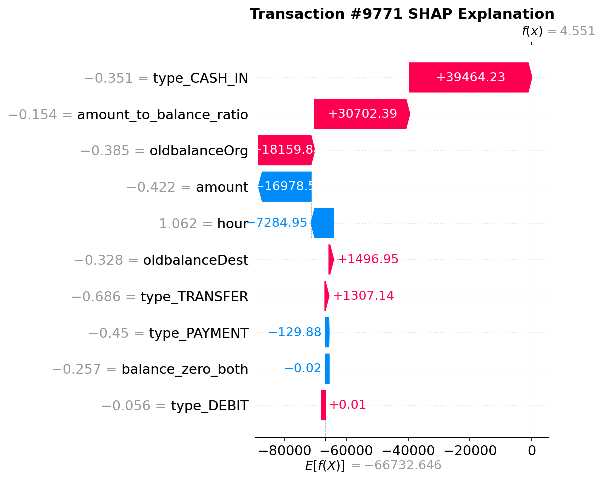
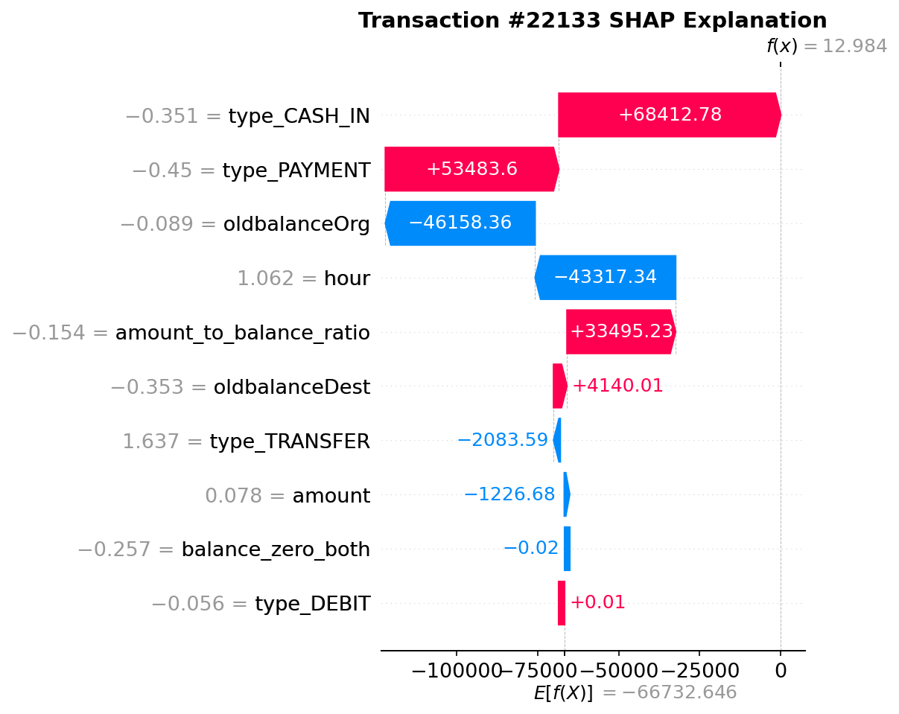

# 📄 의심거래 분석(STR) 자동 생성 보고서

## 1. 📊 모델 성능 요약
- **사용 모델**: Random Forest (n_estimators=200)

- **정밀도(Precision)**: 0.867
- **재현율(Recall)**: 0.951
- **F1-score**: 0.907
- **사기 거래 샘플 수**: 4254.0
- **False Positives**: 622
- **False Negatives**: 207
- **모델 임계값**: 0.869

## 2. 🔍 SHAP 상위 피처 중요도
- type_CASH_IN: 174645.327916
- amount_to_balance_ratio: 90060.252924
- oldbalanceOrg: 40124.634512
- hour: 13999.735357
- amount: 12021.325500

## 3. 🔍 개별 거래 SHAP 설명

### 주요 거래별 모델 판단 근거

#### 거래 #9770 ✅
- **예측**: 사기
- **실제**: 사기
- **판단 정확도**: 정확
- **주요 판단 근거**:
  1. **type_CASH_IN**: -0.3509 (SHAP: +39460.6643) 📈
  2. **amount_to_balance_ratio**: -0.1535 (SHAP: +30623.7634) 📈
  3. **oldbalanceOrg**: -0.3852 (SHAP: +21934.0272) 📈

**🤖 AI 해석**: 거래 ID #9770이 사기로 분류된 주요 이유는 SHAP 분석 결과에서 나타난 세 가지 피처의 긍정적인 기여 때문입니다. 특히, type_CASH_IN, amount_to_balance_ratio, oldbalanceOrg의 SHAP 값이 각각 +39460.6643, +30623.7634, +21934.0272로 나타나, 이 거래가 비정상적인 현금 유입과 비율을 보이며, 기존 잔액과의 불일치가 사기 가능성을 높였음을 시사합니다. 이러한 요소들이 결합되어 모델은 이 거래를 사기로 판단했습니다.

#### 거래 #9771 ✅
- **예측**: 사기
- **실제**: 사기
- **판단 정확도**: 정확
- **주요 판단 근거**:
  1. **type_CASH_IN**: -0.3509 (SHAP: +39464.2281) 📈
  2. **amount_to_balance_ratio**: -0.1535 (SHAP: +30702.3924) 📈
  3. **oldbalanceOrg**: -0.3852 (SHAP: +18159.8387) 📈

**🤖 AI 해석**: 거래 ID #9771이 사기로 분류된 주된 이유는 SHAP 분석 결과에서 나타난 세 가지 주요 피처의 긍정적인 기여 때문입니다. 'type_CASH_IN', 'amount_to_balance_ratio', 'oldbalanceOrg'의 SHAP 값이 각각 높은 증가 효과를 보이며, 이는 거래가 비정상적이고 의심스러운 패턴을 나타내고 있음을 시사합니다. 특히, 이러한 피처들은 일반적인 거래와 비교했을 때 비정상적으로 높은 수치를 기록하여 모델이 이 거래를 사기로 판단하는 데 결정적인 역할을 했습니다.

#### 거래 #22133 ✅
- **예측**: 사기
- **실제**: 사기
- **판단 정확도**: 정확
- **주요 판단 근거**:
  1. **type_CASH_IN**: -0.3509 (SHAP: +68412.7776) 📈
  2. **type_PAYMENT**: -0.4503 (SHAP: +53483.5955) 📈
  3. **oldbalanceOrg**: -0.0889 (SHAP: -46158.3571) 📉

**🤖 AI 해석**: 이 거래는 두 가지 주요 피처(type_CASH_IN 및 type_PAYMENT)의 SHAP 값이 매우 높아 사기로 분류되었습니다. 특히, type_CASH_IN과 type_PAYMENT는 각각 +68412.7776과 +53483.5955의 증가 효과를 나타내어 사기 가능성을 높였으며, 반면 oldbalanceOrg는 -46158.3571의 감소 효과를 보여 거래의 신뢰성을 낮추는 역할을 했습니다. 이러한 피처들의 조합으로 인해 모델은 이 거래를 사기로 판단했습니다.

## 4. 🤖 SHAP 결과 해석 (LLM 자동 생성)
# 금융 사기 탐지 모델의 SHAP 분석 결과 및 피처 중요도 보고서

## 1. 서론
본 보고서는 금융 사기 탐지(Fraud Detection System, FDS) 모델의 SHAP (SHapley Additive exPlanations) 분석을 통해 도출된 주요 피처와 그 중요성을 설명합니다. 각 피처의 중요도는 사기 거래를 탐지하는 데 있어 어떤 역할을 하는지, 그리고 특정 거래 패턴에서 값이 높거나 낮을 때 위험도가 어떻게 변화하는지를 다룹니다.

## 2. 주요 피처 및 중요도

### 2.1 type_CASH_IN (중요도: 174,600)
**설명:** 
'CASH_IN' 거래 유형은 고객이 계좌에 자금을 입금하는 행위를 나타냅니다. 이 피처는 사기 거래에서 특히 중요하게 작용합니다. 사기범들은 종종 대규모 자금을 빠르게 입금한 후, 이를 즉시 인출하는 방식으로 사기를 저지르기 때문입니다.

**위험도 증가 패턴:**
- 대규모 현금 입금 후 즉시 인출 시 사기 위험이 증가합니다.
- 비정상적으로 잦은 CASH_IN 거래가 발생할 경우, 사기 가능성이 높아질 수 있습니다.

### 2.2 amount_to_balance_ratio (중요도: 90,060)
**설명:** 
이 피처는 거래 금액과 계좌 잔액 간의 비율을 나타냅니다. 높은 비율은 고객이 잔액에 비해 비정상적으로 큰 금액을 거래하고 있음을 의미합니다.

**위험도 증가 패턴:**
- 잔액에 비해 비정상적으로 큰 거래가 발생할 경우, 사기 가능성이 높아집니다.
- 일반적으로 고객의 거래 패턴과 비교했을 때, 이 비율이 급격히 증가하면 사기 거래로 간주할 수 있습니다.

### 2.3 oldbalanceOrg (중요도: 40,120)
**설명:** 
'oldbalanceOrg'는 거래 이전의 계좌 잔액을 나타냅니다. 사기 거래는 종종 계좌 잔액이 낮은 상태에서 발생하며, 이는 사기범들이 자금을 빨리 소진하려는 경향

---
보고서 생성 완료 ✅
